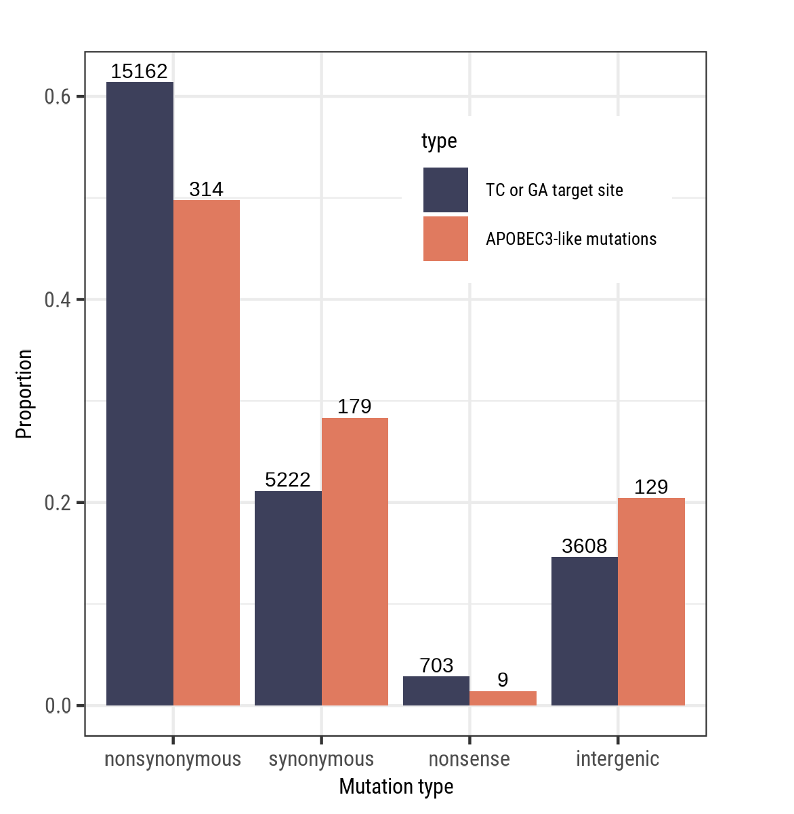

## Mutation category correction for O'Toole *et al.*, Science, 382, 2023 (DOI: 10.1126/science.adg8116)

In the research article, “APOBEC3 Deaminase Editing in Mpox Virus as Evidence for Sustained Human Transmission Since at Least 2016” (Science 382, pp. 595–600, 2023), O’Toole et al. analyzed the mutational landscape of Mpox virus strains and identified an enrichment of TC->TT mutations within the so-called IIb clade, in genomes sampled from 2017 to 2022. The accumulation of these mutations is attributed to the activity of APOBEC3 enzymes, which, as components of the human immune system, target viruses and retrotransposons. The authors suggest that the observed mutational patterns provide compelling evidence that sustained human-to-human transmission of the Mpox virus has been ongoing since 2016. In their analysis, the authors categorized the amino acid changes induced by the observed APOBEC-signature mutations and found that, while the number of nonsynonymous mutations was lower than expected given the number of potential TC/GA targets in the Mpox genome, the number of synonymous mutations was higher than expected. This pattern provides evidence that natural selection acted to eliminate deleterious APOBEC-induced nonsynonymous mutations, while favoring the retention of less harmful synonymous ones. However, the paper lacks discussion of the concerning fact that, contrary to nonsynonymous mutations, the proportion of nonsense mutations is much greater than expected (fig.2A, p-value = 7.43 × 10-3), which could call the authors’ conclusions into question. We reanalyzed the data from the article and identified a technical error that resulted in the systematic misclassification of mutation categories (synonymous, nonsynonymous, nonsense, intergenic). 

*Supplemental table from O’Toole et al., Science, 283:595-600, 2023, showing the reconstructed ancestral state for the B.1 lineage, with the original (incorrect) values highlighted in yellow and the recalculated (corrected) values in green.*

Corrected data demonstrates the opposite effect for nonsense mutations – the number of mutations leading to stop codons is much lower than expected (p-value = 1.46 × 10-3), providing a more consistent view of MPXV mutagenesis and offering further evidence of APOBEC3 enzyme-mediated editing of the Mpox virus.

 
*(Left) Original Figure 2A from O’Toole et al., Science, 283:595–600, 2023; (Right) Figure 2A replotted with corrected data.* 

## Repository Content

The original file containing the reconstructed ancestral state for the B.1 lineage was obtained from the supplementary materials of the O’Toole et al. paper: `hmpxv-apobec3-dd7a582/data/B.1/B.1_2022-08-22.og.aln.pruned.tree.amino_acid.reconstruction.csv`.

`APOBEC3_sites.ipynb` includes transformations of the original data for B.1 lineage mutation sites, code for identifying amino acid changes at these positions and potential target sites for APOBEC in the Mpox genome. The calculated corrected data are saved in `data/B1_data_fixed.csv` and `data/APOBEC_targets_aa.csv`.

The `data` folder contains the original file (`B.1_2022-08-22.og.aln.pruned.tree.amino_acid.reconstruction.csv`) as well as the corrected data (`B1_data_fixed.csv`) and the corrected data filtered for APOBEC-signature motifs (`B1_data_fixed_APOBEC.csv`).

The `plots` folder contains both the original and corrected figures.

